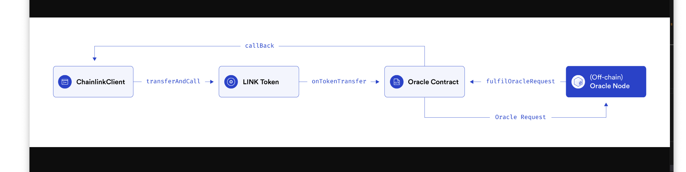

hardhat
truffle

Hardhat Runner 是与 Hardhat 交互的 CLI 命令，是一个可扩展的任务运行器。
extenable task runner

继承

geth


# 钱包
如果你还在被HD钱包(分层确定性钱包)、BIP32、BIP44、BIP39搞的一头雾水，来看看这边文章吧。
私钥通过椭圆曲线生成公钥， 公钥通过哈希函数生成地址，这两个过程都是单向的。
数字钱包实际是一个管理私钥（生成、存储、签名）
私钥是一个32个字节的数，生成一个私钥在本质上在1到2^256之间选一个数字。

密码学安全的随机源

根据一个随机数种子通过分层确定性推导的方式得到n个私钥，
这样保存的时候，只需要保存一个种子就可以，私钥可以推导出来

BIP32就是：为了避免管理一堆私钥的麻烦提出的分层推导方案。

## BIP44
BIP44 为bip32 提供了一个标准的路径

m / purpose' / coin' / account' / change / address_index

m是固定的, Purpose也是固定的，值为44（或者 0x8000002C）
Coin type
这个代表的是币种，0代表比特币，1代表比特币测试链，60代表以太坊

Account
代表这个币的账户索引，从0开始

Change
常量0用于外部(收款地址)，常量1用于内部（也称为找零地址）。

## BIP39
BIP32 提案可以让我们保存一个随机数种子（通常16进制数表示），
不是一堆秘钥，确实方便一些，不过用户使用起来(比如冷备份)也比较繁琐，这就出现了BIP39，它是使用助记词的方式，生成种子的，这样用户只需要记住12（或24）个单词


ether web3
web3 社区优秀 
ether 该自己版本维护容易, 调用简单


4. 归档节点 Archive Node
「归档节点」是在全节点的基础之上，额外储存了每个区块高度的区块状态（个人帐户与合约帐户之当时余额等信息），即针对每个区块高度当下的状态进行快照并存档。归档节点能让你快速回到某个区块高度去查询当下状态：例如你想要知道某一个帐户在区块高度#5,000,000的余额时便会派上用场。
归档节点对于区块链的信任模型与整体安全性原则上「不会有额外的加成或影响」，全节点（包含挖矿节点）已能充分保障全网络的安全。然而如果没有人继续维护归档节点的话，查询区块链上的历史资料得花费许多的时间。Archive Node保存了区块链上的完整历史纪录与资料，以及所有区块高度的当时全网状态。

不是归档节点就是128个区块以内的


graph 
设计比较巧妙的地方
https://info.uniswap.org/#/ 数据聚合都是thegraph

算法稳定币 都说自己是质押型的
n个成分组合起来等于1美元 (usdc+usdt)





交易结构:
```
  hash: '0x82ffa60c0b9ae50d6c0fb69415fc54970837301f9b6590fa320abe5aa94d4ae7',
  type: 2,
  accessList: [],
  blockHash: '0xc2fff0bb5e6ae9cc7238f0374fe905ff92a29e9459615dd868c2bee63a8af330',
  blockNumber: 17,
  transactionIndex: 0,
  confirmations: 1,
  from: '0xf39Fd6e51aad88F6F4ce6aB8827279cffFb92266',
  gasPrice: BigNumber { value: "1111257488" },
  maxPriorityFeePerGas: BigNumber { value: "1000000000" },
  maxFeePerGas: BigNumber { value: "1222514976" },
  gasLimit: BigNumber { value: "29021784" },
  to: '0x0DCd1Bf9A1b36cE34237eEaFef220932846BCD82',
  value: BigNumber { value: "0" },
  nonce: 16,
  data: '0x11ef68c50000000000000000000000000000000000000000000000000de0b6b3a7640000',
  r: '0x9daf78f5f4172487e9af6a72ab1f3e24446124346f32d986d8f2c66cf0dbade8',
  s: '0x0bd65959b7551cb338a1b7051cb77a7547dc0810c0ff4161e29d0856775f2d07',
  v: 1,
  creates: null,
  chainId: 31337,
  wait: [Function (anonymous)]
}
```


除了 eip721 还有甚么


    function getBytecode1() external pure returns (bytes memory) {
        bytes memory bytecode = type(TestContract1).creationCode;
        return bytecode;
    }

    function getBytecode2(uint _x, uint _y) external pure returns (bytes memory) {
        bytes memory bytecode = type(TestContract2).creationCode;
        return abi.encodePacked(bytecode, abi.encode(_x, _y));
    }

    function getCalldata(address _owner) external pure returns (bytes memory) {
        return abi.encodeWithSignature("setOwner(address)", _owner);
    }