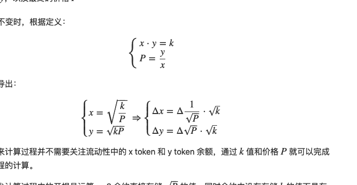

暴露隐私不够透明 插针, 大户订单买入
恒定资产比例池，两种资产比例在50/50；混合资产池，支持3种及以上资产；
加权池，多种资产比例。恒定资产比例池最常见，比如BTC/USD，ETH/USD。 
加权池可以保持资产不变

用户存入加权池 获得lptoken 相当于存款凭证  
分得的交易手续费放到加权池中 有的还有平台原生代币的奖励

恒定乘积做市商
恒定和做市商
恒定平均值做市商

x+y =k 0滑点 但是不能提供无限的流动性 允许耗尽其中一种资产

1. 无常损失 
需要套利者帮助回复价差
2. 资本效率低。
Uniswap3在引入主动做市协议，希望解决这一问题，但似乎并不是很智能。
被动做市的缺点是当交易活跃时，当前价格附近的流动性很快会枯竭，同时伴随滑点升高，价格快速发生较大偏离，导致交易停止，这样使得流动性池的资金使用率不高，

第三， 多代币敞口的风险。作为LP需要购买另一种资产以提供流动性，这将增加对另一资产的敞口，意味着要承受多重代币价格浮动的风险。

比如一开始的btc价格是100 usdt
质押进去 100 usdt/和1btc

然后价格到了90 
别人提出1btc 就只能兑90  还有10块钱就浪费了

(1btc <=> 90usdt) 10usdt

合约内要维护一个流动性L 表示当前价格对应的流动性都是多少
pl = l1 + l2 + l3 
根据不同的流动性拆分成不同的数据
区间大小是怎么定的

你能提供的流动性 肯定不足这些 你的是平滑分布在价格曲线上的

正常情况下 中心化的交易所

bid  0.2 v

bid  0.1 v + 99000