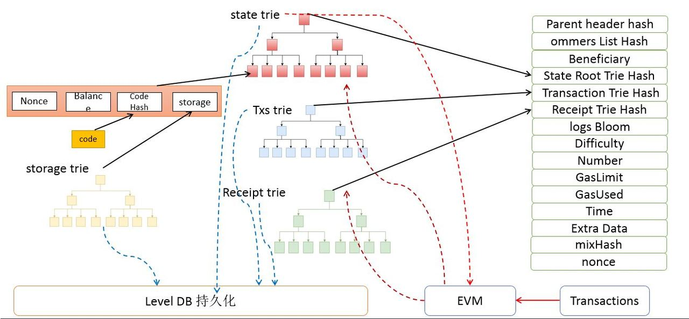
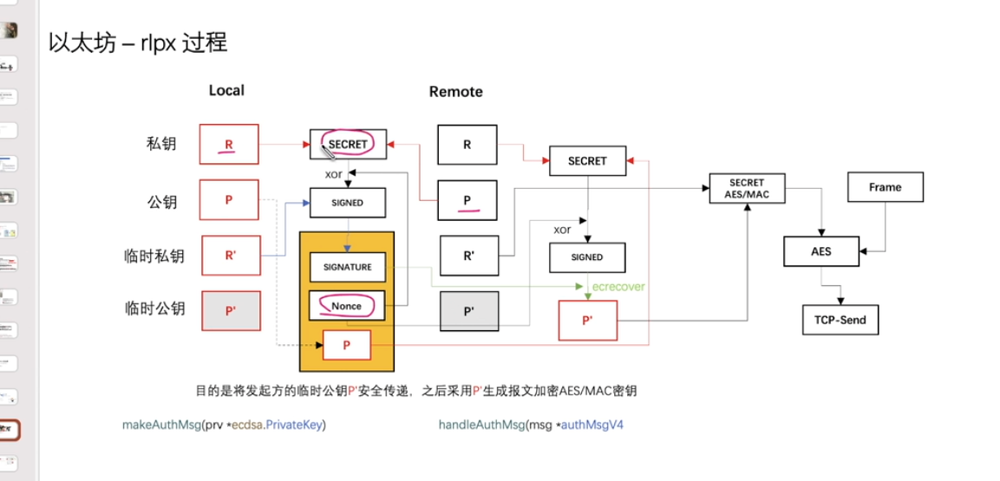
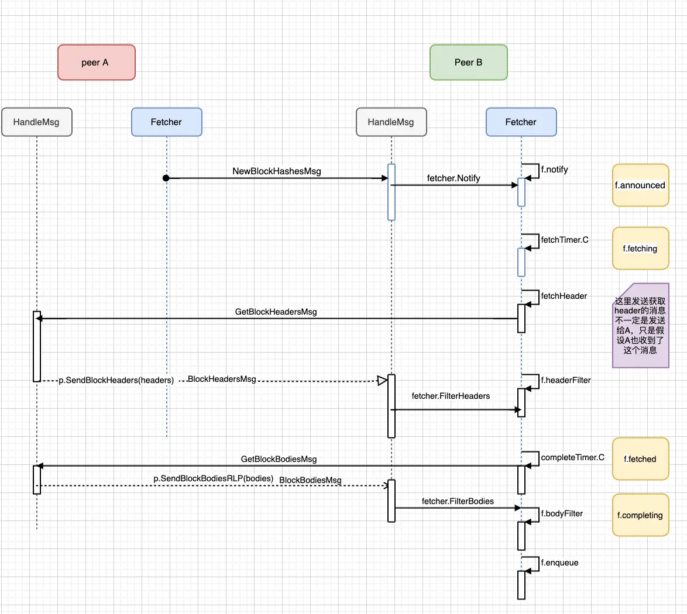
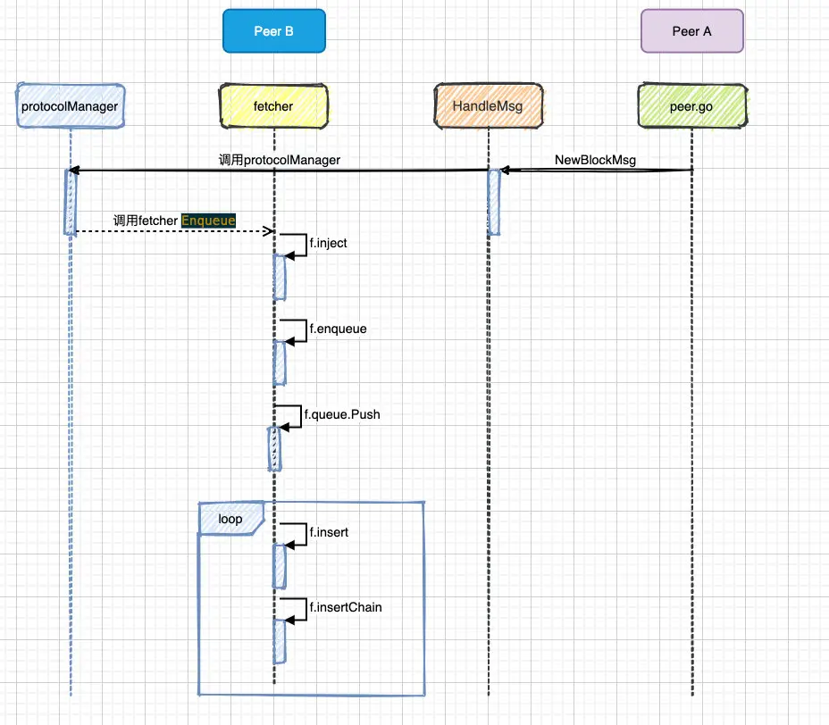
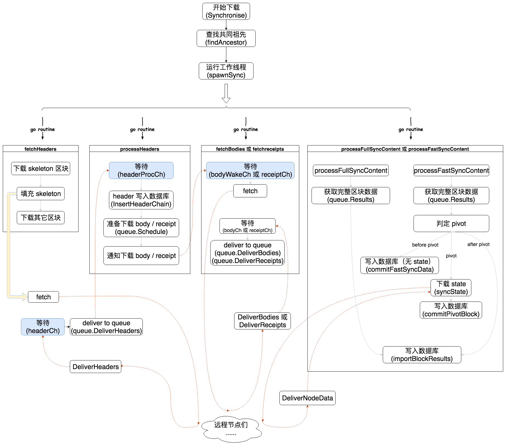
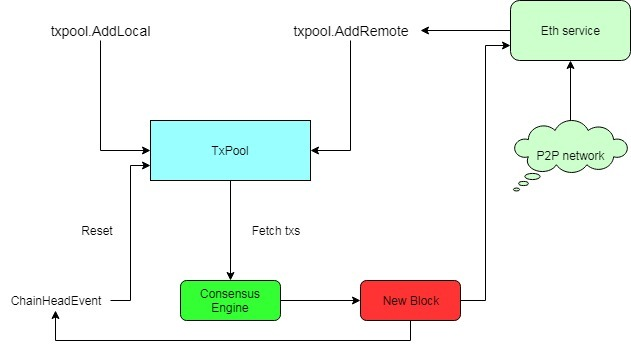

区块链结构

#### Node/Service
我们知道geth程序的执行过程本质上就是一个node的生存周期。


对于node，主要会有config/new/start/wait/stop几个过程。

对于service，主要会有SetConfig/RegisterServic/construct/start几个过程。

根据config配置node/service(eth/ssh/dashboard/ethstats)
创建node，即配置node实例
将service注册到node
启动node，即启动p2p以及注册的service，启动RPC
主进程挂起


标识 - Name/UserIdent/Version
数据目录 - DataDir/KeyStoreDir
p2p - P2P/Logger
HTTP RPC - HTTPHost/HTTPPort/HTTPCors/HTTPVirtualHosts/HTTPModules
websocket RPC - WSHost/WSPort/WSOrigins/WSModules/WSExposeAll
系统资源使用 - UseLightweightKDF
硬件钱包 - NoUSB
进程间通信 - IPCPath


我们会看到，node中会涉及：
config
event
account manager
p2p
rpc
ipc
http rpc
websocket rpc

##### rlp:  
RLP把所有的数据看成两类数据的组合， 一类是字节数组， 一类是类似于List的数据结构。   
我理解这两类基本包含了所有的数据结构。 比如用得比较多的struct。 可以看成是一个很多不同类型的字段组成的List  
  
  
typecache.go 中可以通过自身的类型来快速的找到自己的编码器函数和解码器函数。  
  
  
makeWriter encode中返回每个类型的编码器  
  
  
大部分的EncodeRLP方法都是直接调用了这个方法Encode方法: 
``` go
func Encode(w io.Writer, val interface{}) error {  
```
这个方法首先获取了一个encbuf对象。 然后调用这个对象的encode方法。encode方法中，首先获取了对象的反射类型，根据反射类型获取它的编码器，然后调用编码器的writer方法。  
  
  
  
  
然后我们可以看看encbuf最后的处理逻辑，会对listhead进行处理，组装成完整的RLP数据  
```go
func (w *encbuf) toBytes() []byte {  
```
  
  
剩下的流程其实比较简单了。 就是根据黄皮书针把每种不同的数据填充到encbuf里面去。  
```go
func writeBool(val reflect.Value, w *encbuf) error {  
```
  
在刚开始处理结构体的时候，并不知道处理后的结构体的长度有多长，   
```go
func makeStructWriter(typ reflect.Type) (writer, error) {  
		fields, err := structFields(typ)  
		...  
		writer := func(val reflect.Value, w *encbuf) error {  
			lh := w.list()  
			for _, f := range   
  
```
typeche   
encode makeWriter  
decode makeDecoder  
  
encode -> cachedWriter ->theTC.info -> generate 一系列 -> makeWriter 各类类型判断 -> makeSliceWriter -> infoWhileGenerating -> generate  
  
##### trie树  
根据block里面的头把树恢复出来  
  
trie的结构最终都是需要通过KV的形式存储到数据库里面去，然后启动的时候是需要从数据库里面加载的。  
  
 就调用trei.resolveHash方法来加载整颗Trie树  
  
 shortnode 是叶子节点  
 fullnode 是branch 节点  
 hashnode  是hash值 还没加载进来  
  
  
  
 node的所有子节点都替换成了子节点的hash值，那么直接调用rlp.Encode方法对这个节点进行编码  
  
  
 从数据库里加载出来 解码:  
 resolveHash- > mustDecodeNode  
 如果是2个字段那么就是shortNode节点，如果是17个字段，那么就是fullNode，  
 然后分别	decodeShort ,decodeFull  
  
通过SplitString方法解析出来val然后生成一个shortNode。  
  
  
Trie树的cache管理  
这两个参数就是cache控制的参数。 Trie树每一次调用Commit方法，会导致当前的cachegen增加1。  
  
然后在Trie树插入的时候，会把当前的cachegen存放到节点中。  
  
  
如果 trie.cachegen - node.cachegen > cachelimit，就可以把节点从内存里面卸载掉。 也就是说节点经过几次Commit，都没有修改，那么就把节点从内存里面卸载，以便节约内存给其他节点使用。  
会用一个hashNode节点来表示这个节点以及其子节点。 如果后续需要使用，可以通过方法把这个节点加载到内存里面来。  
如果方法的canUnload方法调用返回真，那么就卸载节点  
  
也就是说有可能是hash  有可能是真正的节点  
如果是hash 就可以直接做merkle 证明  
  
  
##### p2p  

节点的地址不能有冲突
尽可能的高效的寻址
如何保持网络拓扑的一致性
如何的处理节点状态的变化（新加入与退出）


// 使用rlpx.go来处理加密链路。 使用discover来处理节点发现和查找。 使用dial来生成和连接需要连接的节点。 使用peer对象来处理每个连接。  
// 四个对象的组合 rlpx dicover(table) dialschedule peer  
  
  
  
每个邻居节点的数据都以Enode展示的，Enode中含有公钥+IP和端口  
  
  
p2p/server.go start() setupDiscovery  ListenV4/ ListenV5  
进去以后loop中有三个定时器  测试邻居节点连通性 维护k桶   
  
go tab.loop() // doRefresh、doRevalidate、copyLiveNodes  
	- doRefresh:  
		对随机目标执行查找以保持K桶已满。如果表为空（初始引导程序或丢弃的有故障），则插入种子节点。  
			tab.loadSeedNodes() 从数据库加载随机节点和引导节点。这应该会产生一些以前见过的节点  
			tab.net.lookupSelf() 将本地节点ID作为目标节点进行查找最近的邻居节点 newLookup -> findnode 发现协议 findnode 要返回neighbors  
	- doRevalidate  
		检查随机存储桶中的最后一个节点是否仍然存在，如果不是，则替换或删除该节点。 pingpong 然后replace  
  
	- copyLiveNodes:  
		copyLiveNodes将表中的节点添加到数据库,如果节点在表中的时间超过了5分钟。  
  
  
  
  
  
  
节点第一次启动的时候，节点会与硬编码在以太坊源码中的bootnode进行连接，所有的节点加入几乎都先连接了它。连接上bootnode后，获取bootnode部分的邻居节点，然后进行节点发现，获取更多的活跃的邻居节点  
nursery 是在 Table 为空并且数据库中没有存储节点时的初始连接节点（上文中的 6 个节点），通过 bootnode 可以发现新的邻居  
  
  
b. 通过tab.loadSeedNodes()——>tab.db.querySeeds()来从本地database获得最多30个节点；  
  
  
tab.seedRand：使用提供的种子值将生成器初始化为确定性状态  
loadSeedNodes：加载种子节点；从保留已知节点的数据库中随机的抽取30个节点，再加上引导节点列表中的节点，放置入k桶中，如果K桶没有空间，则假如到替换列表中。  
  

  
  
  
  
K-桶初始化的过程 ：  
  
1、先新建table对象，连接本地database，如果本地没有database，则先新建一个空的database；  
2、初始化K-桶，先获得k-桶信息的源节点：  
a. 通过setFallbackNodes(bootnodes)来获得5个nursey节点；  
b. 通过tab.loadSeedNodes()——>tab.db.querySeeds()来从本地database获得最多30个节点；  
3、把上面的节点存入seeds，进行for循环；  
4、在循环内执行tab.add(seed)，计算seed节点与本节点的距离，选择相应距离的bucket。如果bucket不满，则用bump()存入bucket；如果bucket已满，则放入replacements。  
  
  
doRefresh: 更新及维护流程  
  
  
lookupSelf -> lookup.run() -> findNodes()   
  
  
  
Ping：用于探测一个节点是否在线  
Pong：用于响应 Ping 命令  
FindNode：用于查找与 Target 节点异或距离最近的其他节点  
Neighbours：用于响应 FindNode 命令，会返回一或多个节点  
  
  
  
主要功能就是提供接口可以把内网的IP+端口 映射为 路由器的IP+端口。 这样就等于内网的程序有了外网的IP地址， 这样公网的用户就可以直接对你进行访问了。 不然就需要通过UDP打洞这种方式来进行访问。  
  
  
RLPx Encryption(RLPx加密)  
入口:  
setupConn  
每一个节点会开启两个同样的端口，一个是UDP端口，用来节点发现，一个是TCP端口，用来承载业务数据。 UDP的端口和TCP的端口的端口号是同样的。 这样只要通过UDP发现了端口，就等于可以用TCP来连接到对应的端口。  
  
 链接的两方生成生成随机的私钥，通过随机的私钥得到公钥。 然后双方交换各自的公钥， 这样双方都可以通过自己随机的私钥和对方的公钥来生成一个同样的共享密钥(shared-secret)  
  
 setupConn  
 egressMac主动  
 ingressMac被动  
  
 doEncHandshake ECDH 通过公钥和私钥协商出一个共享密钥来  
 协商出来的密钥作为aes 加密的公钥  
  
  
  
// 都是通过aes 加密出来的  
  egressMac			ingressMac   
				X   
 ingressMac 		egressMac  
  
  
doprotoHandshake 协议握手 就是p2p  
协商完了做下配置  
writeFrame  收发数据都通过这个函数进行  
  
  
  
- 自己的私钥和对方的公钥生成一个数, 然后这个secret和 nonce xor  得到x, x和链式私钥生成signed,   
- signed, 自己的公钥, 和nonce 发到对面  
- 对面收到的公钥和 对面自己持有的私钥生成signed1  
- signed1 和 nonce xor 还原成x, x放入ecrecover 得到己方临时私钥对应的公钥p'  
- p'和对面的临时私钥生成aes的共享密钥, 使用这个共享密钥做对称加密  
  
  
  
  
server对象主要完成的工作把之前介绍的所有组件组合在一起。 使用rlpx.go来处理加密链路。 使用discover来处理节点发现和查找。 使用dial来生成和连接需要连接的节点。 使用peer对象来处理每个连接。  
// 启动一个listenLoop来监听和接收新的连接。 启动一个run的goroutine来调用dialstate生成新的dial任务并进行连接。 goroutine之间使用channel来进行通讯和配合。  
  
  
### eth:  
- fetcher:  
	主要用于基于块通知的同步，接收到当我们接收到NewBlockHashesMsg消息得时候，我们只收到了很多Block的hash值。    
	需要通过hash值来同步区块。  
	主动同步是指节点主动向其他节点请求区块数据，比如geth刚启动时的syning，以及运行时定时和相邻节点同步  
	入口:
	 
	```go  
	start():  
		minedBroadcastLoop() -> BroadcastBlock()  
			AsyncSendNewBlock // 发送区块  触发消息: NewBlockHashesMsg   
			AsyncSendNewBlockHash // 发送区块hash 触发消息:	NewBlockMsg  
	```


	#### 首先整体架构
	两边互相call到 有个无限循环不停 handleMessage
	然后双端发出消息后都在loop中监听, handler接受到消息也都是流转到loop里面


	全部的双端通信协议
	```go
	var eth66 = map[uint64]msgHandler{
		NewBlockHashesMsg:             handleNewBlockhashes,
		NewBlockMsg:                   handleNewBlock,
		TransactionsMsg:               handleTransactions,
		NewPooledTransactionHashesMsg: handleNewPooledTransactionHashes,
		GetBlockHeadersMsg:            handleGetBlockHeaders66,
		BlockHeadersMsg:               handleBlockHeaders66,
		GetBlockBodiesMsg:             handleGetBlockBodies66,
		BlockBodiesMsg:                handleBlockBodies66,
		GetNodeDataMsg:                handleGetNodeData66,
		NodeDataMsg:                   handleNodeData66,
		GetReceiptsMsg:                handleGetReceipts66,
		ReceiptsMsg:                   handleReceipts66,
		GetPooledTransactionsMsg:      handleGetPooledTransactions66,
		PooledTransactionsMsg:         handlePooledTransactions66,
	}
	```


	fetcher 的四个queue:
	```
	announced:此阶段代表节点宣称产生了新的区块（这个新产生的区块不一定是自己产生的，也可能是同步了其它节点新产生的区块），Fetcher 对象将相关信息放到 Fetcher.announced 中，等待下载。

	fetching：此阶段代表之前「announced」的区块正在被下载。

	fetched：代表区块的 header 已下载成功，现在等待下载 body。

	completing：代表 body 已经发起了下载，正在等待 body 下载成功。

	queued:代表 body 已经下载成功。因此一个区块的数据：header 和 body 都已下载完成，此区块正在等待写入本地数据库。
	```


	这两个消息又是分别由 peer.AsyncSendNewBlockHash(->BroadcastBlock) 和 peer.AsyncSendNewBlock(->AsyncSendNewBlockHash) 两个方法发出的，这两个方法只有在矿工挖到新的区块时才会被调用  
  
	#### 具体流程:
	主动发送区块: 发handleNewBlockhashes到对端, 对端过滤,, 转移annonce数据到fetching, 回 GetBlockHeadersMsg,本端发挥header信息,对端发GetBlockBodiesMsg,
	
	从 NewBlockHashesMsg 开始:
	1. 矿工发起NewBlockHashesMsg
	2. 对端收到 构造announce, 流转到notify
		对端执行到`handleNewBlockhashes` -> backend.handle(这时backend为ethHandler) -> eth/handler_eth.go:Handle 流转到notify
		 
		notify 流程:
		检查 fetching和completing两个队列 , 如果不存在此区块哈希时,则把此区块哈希放入到announced中，准备拉取header和body。
		然后 <-fetchTimer.C 时间到了继续执行流程:
			择要下载的区块，从 announced 转移到 fetching 中,发送下载 header 的请求 (fetchHeader(hash)
		发送回本端, 接受到`GetBlockHeadersMsg`
	3. 本端收到以后的流程:
		- 过滤header:
		- downloader.DeliverHeaders 通知downloader对象
		- 判断此区块在本地是否已存在,如果不存在且只有header（空块），直接放入complete以及f.completing中，否则就放入到incomplete中等待同步body。
	4. 拉取body
		- completeTimer.C，从f.fetched获取哈希,在发送 `GetBlockBodiesMsg`到对端
		- 对段收到消息, 过滤掉filter请求的body 同步，
			其他的都交给downloader:completeTimer.C: -> fetchbodies -> concurrentFetch  -> diliver 通知下载
			先发一个通信用的 channel 给 bodyFilter
	将要过滤的 bodyFilterTask 发送给 filter
	检索过滤后剩余的body

	上面的流程是从旷工 发出NewBlockHashesMsg 到同步区块为止
	- 同步区块: 从NewBlockMsg开始：
		- fetcher模块导入远程节点发过来的区块

		```go
			pm.fetcher.Enqueue(p.id, request.Block)
		```
		- 主动同步远程节点:
		```go
		if _, td := p.Head(); trueTD.Cmp(td) > 0 {
				p.SetHead(trueHead, trueTD)
				currentBlock := pm.blockchain.CurrentBlock()
				if trueTD.Cmp(pm.blockchain.GetTd(currentBlock.Hash(), currentBlock.NumberU64())) > 0 {
					go pm.synchronise(p)
				}
			}
		```
	- 将区块送入到queue中，接下来就是要回到loop函数中去处理queue中的区块。
		```go
		if _, ok := f.queued[hash]; !ok {
			// ...
			f.queue.Push(op, -int64(block.NumberU64()))
		}
		```
	- 倒入区块:
	```go
	if _, err := f.insertChain(types.Blocks{block}); err != nil 
	```
	- 倒入成功广播此块:
	```go
	go f.broadcastBlock(block, false)
	```

	流程图片:
	


	#### 代码流程:
	入口:  
	node.Start()  
	eth/backeend.go -> ethereum.start()->handler.Start:  
		交易广播  
		区块广播 <-  
  
 
	消息的监听 在 handler - > handlerAnnouncement-> notiofy 函数回收到blockfetcher的loop中
	```
	 //notify -> fetcher.loop :		
		case notification := <-f.notify:
			写入announce
	```


	Fetcher负责被动同步，主要做以下事情：    
```  
		收到完整的block广播消息(NewBlockMsg)    
		收到blockhash广播消息(NewBlockHashesMsg)    
```  


  


  
  
  
  
downloader 主要用于和网络同步，包含了传统同步方式和快速同步方式  
filter 提供基于RPC的过滤功能，包括实时数据的同步(PendingTx)，和历史的日志查询(Log filter)  
gasprice 提供gas的价格建议， 根据过去几个区块的gasprice，来得到当前的gasprice的建议价格  
  
  
区块数据同步分为被动同步和主动同步:  
  
被动同步是指本地节点收到其他节点的一些广播的消息，然后请求区块信息。  
  
#### downloader
三种模式
fullmode:
也叫FullSync
一种是传统的fullmode,这种模式通过下载区块头，和区块体来构建区块链，同步的过程就和普通的区块插入的过程一样，包括区块头的验证，交易的验证，交易执行，账户状态的改变等操作，这其实是一个比较消耗CPU和磁盘的一个过程。

另一种模式就是 快速同步的fast sync模式， 这种模式有专门的文档来描述。请参考fast sync的文档。简单的说 fast sync的模式会下载区块头，区块体和收据， 插入的过程不会执行交易，然后在一个区块高度(最高的区块高度 - 1024)的时候同步所有的账户状态，后面的1024个区块会采用fullmode的方式来构建。 这种模式会加区块的插入时间，同时不会产生大量的历史的账户信息。会相对节约磁盘， 但是对于网络的消耗会更高。 因为需要下载收据和状态。



入口:
downloader/Synchronise

completeTimer.C: -> fetchbodies -> concurrentFetch  -> diliver 通知下载 -> Synchronise
-> syncWithPeer

```go
func syncWithPeer:
		fetchHeaders()
		findAncestor()
		func() error { return d.fetchBodies(origin+1, beaconMode) },   // Bodies are retrieved during normal and snap sync
		func() error { return d.fetchReceipts(origin+1, beaconMode) }, // Receipts are retrieved during snap sync
		func() error { return d.processHeaders(origin+1, td, ttd, beaconMode) }

```	
在同步时，会同时启动多个 go routine 来同步不同的数据，比如 header、body、receipt 等
但除 header 之外，其它数据总要等到获取到相应的 header 后才开始同步
比如要同步高度为1万的区块，那么需要先同步高度为1万的 header，成功后再通知同步 body 和 receipts 的线程

注意:
Downloader.bodyWakeCh 
Downloader.receiptWakeCh

 ##### 概念解析:
- skeleton:
在同步 header 时，会先从指定的节点中同步一个骨架（skeleton），然后再调用 Downloader.fillHeaderSkeleton 填充这个骨架。所谓的「skeleton」，是指每隔一定的区间同步一个区块，我们会在下面的详细进行说明。


- privot:

在 fast 模式下，downloader 还有一个「pivot」的概念。
我们知道 fast 模式不会在本地计算 state 和 receipt 数据。
但在同步时，还是会有某个高度以后的区块的 state 会在本地计算，而非从网络同步，这个高度就是 pivot。高度低于 pivot 的区块没有 state 数据；pivot 区块从网络中同步 state；高度大于 pivot 的区块则在本地计算 state 数据。关于 pivot 的具体内容我们在下面还会进行详细的说明。

- queue:
downloader 模块中，还有一个 queue 对象。这个对象的功能就是对将要同步的数据进行管理，以及将同步到的数据进行组装。比如在同步之初，Downloader 对象会将需要同步的「骨架」写入 queue 对象中，并在header同步成功时告诉 queue ；而下载 body 和 receipt 的线程也可能询问 queue 有哪些数据是它们可以下载的。最后， Downloader 还可以询问 queue 对象有哪些区块的所有数据已经下载完成了


findAncestor:
1. 区块同步的第一件重要的事情，就是确定需要同步哪些区块。  
2. 这里使用一个高度区间来表示这些需要同步的区块，这个区间的顶是远程节点的区块的最高值，这个从 eth 下的 peer.Head 方法中可以获取；而区间的底就是两个节点都拥有的相同区块的最高高度。
3. 一般情况下，本地节点中的主链上高度最高的区块可以满足这个条件


查找共同祖先的方式有两种:
1. 固定间隔法
Downloader.findAncestor 中首先使用固定间隔的方法查找共同祖先。
2. 二分法 没看

在调用 Downloader.findAncestor 获取到共同祖先以后，就可以确定同步范围并开始进行区块同步了。


其想法是每次从某个节点获取的区块的数据是有限制的，大小为 MaxHeaderFetch  
那么如果将要下载的 header 的数量大于这个值 就得将它们按高度分组  
从每组中选出最后一个元素，就组成了 skeleton。


代码会先将 skeleton 中的所有 header 下载下来，然后为刚才的每一个分组随机选取空闲节点进行下载，也就是谓的「填充skeleton」
这种下载方式其实是避免了从同一节点下载过多错误数据这个问题。


方法:

Downloader.fetchHeaders:
fetchHeaders: 发送header请求，等待所有的返回。, 不断的重复这样的操作，直到完成所有的header请求。
为了提高并发性，同时仍然能够防止恶意节点发送错误的header，我们使用我们正在同步的“origin”peer构造一个头文件skeleton
并使用其他人填充缺失的header。 其他peer的header只有在干净地映射到骨架上时才被接受。
如果没有人能够填充骨架 - 甚至origin peer也不能填充 - 它被认为是无效的，并且origin peer也被丢弃。


processHeaders方法:
，这个方法从headerProcCh通道来获取header。并把获取到的header丢入到queue来进行调度，这样body fetcher或者是receipt fetcher就可以领取到fetch任务。

	通过 这个函数  concurrentFetch 之前fetcher 通知下载的函数,真正去下载块体


- queue:

queue给downloader提供了调度功能和限流的功能。 
Schedule:
Schedule调用申请对一些区块头进行下载调度。可以看到做了一些合法性检查之后，把任务插入了blockTaskPool，receiptTaskPool，receiptTaskQueue，receiptTaskPool。 TaskPool是Map，用来记录header的hash是否存在。 TaskQueue是优先级队列，优先级是区块的高度的负数， 这样区块高度越小的优先级越高，就实现了首先调度小的任务的功能。  

ReserveXXX方法用来从queue里面领取一些任务来执行。downloader里面的goroutine会调用这个方法来领取一些任务来执行。 这个方法直接调用了reserveHeaders方法。 所有的ReserveXXX方法都会调用reserveHeaders方法，除了传入的参数有一些区别。

DeliverXXX方法把下载完的数据给queue。 

ExpireXXX用来控制任务是否超时， CancelXXX用来取消任务。


- 总结
downloader 模块对区块的下载分成两种模式，一种是 full 模式，另一种是 fast 模式。在 full 模式下只下载区块的 header 和 body； fast 模式下除了 header 和 body，还会下载所有区块的 receipt 数据和 pivot 区块的 state 数据，pivot 区块以后的区块，就和 full 模式一样了。

1. 在下载前，eth 模块会选择一个 「best peer」 给 downloader 模块，所谓的 「best peer」 其实就是「TotalDifficulty」值最大的那个节点（关于 TotalDifficulty 概念的详细解释可以参看这篇文章）。
2. 在 downloader 中，首先通过 findAncestor 方法确定自己与 「best peer」 之间的共同组先，然后从这个共同组先开始，至对方的高度最高的那个区块，组成需要下载的区块高度区间进行下载。在下载的过程中， downloader 模块会先将这个区间中的 header 分组，每组的最后一个区块组成 「skeleton」，首先从 「best peer」 中下载这些 skeleton，然后选择其它节点对每一组 header 进行下载（就是所谓的「填充 skeleton」）。每当有 header 下载成功后，就会接着下载它所对应的 body 和 receipt（full 模式下只下载 body）。

3. 在 fast 模式下，downloader 模块在下载区块的过程中，还会从高度较高的区块中选择一个区块作为 「pivot」 区块。 pivot 区块的特殊点在于，在它之前的区块是没有 state 数据的；而 pivot 区块的 state 对数是从其它节点中下载的；pivot 之后的区块以 pivot 区块的 state 为基础，在本地通过 body 计算出自己的 state 数据并存储起来（也就是说 pivot 之后的区块和 full 模式下的区块的处理方式是一样的）。

4. 在整个下载过程中，需要 Downloader 对象和 queue 对象密切配合，共同完成区块下载的逻辑。本篇文章里我们只分析了 Downloader 对象的一些实现，


#### 布隆过滤器 bloom indexer:
- 以太坊专门设立了针对bloom bits的索引。 把区块的bloom bits 整合起来，使得查询更为高效。
- log通过bloom9 协议生成bloombits
- block的结构， 里面有一个bloom bits, 在每一笔交易的收据中，也存在bloom bits,每一个log中有它自己的对应的bloom bits。
- log 的bloom bits 加和是 tx 的bb , tx 的加和是块的bb
- bloom bits的结构:
 1. 256Bytes， 2048 bits。
 2. 那么log info的组成部分实际上是 记录log 的合约地址， log 的topic签名（名字，参数列表）， 以及数据。


indexer:
实际上是一个二维数组:
blooms[1234][1432] 表达的其实是section中第1432 区块bloom bit的第1234 bit位。

```go
type Generator struct {
	blooms   [types.BloomBitLength][]byte // Rotated blooms for per-bit matching
	sections uint                         // Number of sections to batch together
	nextSec  uint                         // Next section to set when adding a bloom
}
```

chainindxer 包含4个方法: reset process， commit  prune


loop:
如果update Channel 不为空， 触发条件是规范链已知的section number已经更新，或者规范连有reorg 导致rollback 等等。
判断是否可处理的section number大于已经处理的section number。
如果是， 就开始处理新的待处理section

updateLoop-> proocessSession:
- reset -> Process 方法， 其实就是把对应的区块header的bloom加入到generator 维护的表中 -> commit 提交到数据库


父子索引数据的关系 父Indexer负载事件的监听然后把结果通过newHead传递给子Indexer的updateLoop来处理。

setValidSections方法，写入当前已经存储的sections的数量。 如果传入的值小于已经存储的数量，那么从数据库里面删除对应的section


#### state:
core/state 包主要为以太坊的state trie提供了一层缓存层(cache)

database.go 提供了一个数据库的抽象
cachingDB 使用了上面这个接口封装了数据库的抽象

OpenTrie，从缓存里面查找。如果找到了返回缓存的trie的copy， 否则重新构建一颗树返回。
ContractCode 和 ContractCodeSize, ContractCodeSize有缓存。

cachedTrie的结构和commit方法，commit的时候会调用pushTrie方法把之前的Trie树缓存起来。


- 以太坊帐户:
stateObject 关联db contractcode storagetrie ,trie

cachedStorage Storage // Storage entry cache to avoid duplicate reads 用户存储对象的缓存，用来避免重复读
dirtyStorage  Storage // Storage entries that need to be flushed to disk 需要刷入磁盘的用户存储对象


onDirty   func(addr common.Address) // Callback method to mark a state object newly dirty  第一次被设置为drity的时候会被调用。


- statedb.go:
stateDB用来存储以太坊中关于merkle trie的所有内容。 StateDB负责缓存和存储嵌套状态。 这是检索合约和账户的一般查询界面：
stateObject 的那个db就是statedb

```go
type stateObject struct {
	address  common.Address
	addrHash common.Hash // hash of ethereum address of the account
	data     types.StateAccount
	db       *StateDB

```


获得一个账号 缓存没有就去trie树中取
```go
func (self *StateDB) getStateObject(addr common.Address) (stateObject *stateObject) {
```


快照和回滚功能

```go
// Snapshot returns an identifier for the current revision of the state.
func (self *StateDB) Snapshot() int {
	id := self.nextRevisionId
	self.nextRevisionId++
	self.validRevisions = append(self.validRevisions, revision{id, len(self.journal)})
	return id
}
//回滚函数
func (self *StateDB) RevertToSnapshot(revid int) {
```


CommitTo:
用来提交更改。


#### StateTransition
几乎就跟一笔交易中的数据差不多
```go
type StateTransition struct {
	gp         *GasPool   //用来追踪区块内部的Gas的使用情况
	msg        Message		// Message Call
	gas        uint64
	gasPrice   *big.Int		// gas的价格
	initialGas *big.Int		// 最开始的gas
	value      *big.Int		// 转账的值
	data       []byte		// 输入数据
	state      vm.StateDB	// StateDB
	evm        *vm.EVM		// 虚拟机
}
```


执行一笔交易的整个过程:
ApplyMessage 执行一个状态转移 -> state_processor.go/TransitionDb()

```go
	contractCreation := msg.To() == nil // 如果msg.To是nil 那么认为是一个合约创建
	// TODO convert to uint64
	// 计算最开始的Gas  g0
	intrinsicGas := IntrinsicGas(st.data, contractCreation, homestead)


	if contractCreation { //如果是合约创建， 那么调用evm的Create方法
		ret, _, st.gas, vmerr = evm.Create(sender, st.data, st.gas, st.value)
	} else {
		// Increment the nonce for the next transaction
		// 如果是方法调用。那么首先设置sender的nonce。
		st.state.SetNonce(sender.Address(), st.state.GetNonce(sender.Address())+1)
		ret, st.gas, vmerr = evm.Call(sender, st.to().Address(), st.data, st.gas, st.value)
	}


	// 退钱  矿工打钱
	st.refundGas()  //计算Gas的退费 会增加到 st.gas上面。 所以矿工拿到的是退税后的
	st.state.AddBalance(st.evm.Coinbase, new(big.Int).Mul(st.gasUsed(), st.gasPrice)) // 给矿工增加收入。
```


- StateProcessor
交易的执行模块
ApplyTransaction 

也是调用 ApplyMessage 和上面那个一样


#### VM虚拟机:
- stack.go 
就是push pop
- memory.go
内存
- jumptable.go: [256]operation
指令集.
- instruction.go
所有指令
- gas_table.go
返回了各种指令消耗的gas的函数 
- interpreter.go 
一个循环不断地从contract 中提取指令 并且运行 检查gas 检查内存 检查stack


```go
type Contract struct {
	// CallerAddress is the result of the caller which initialised this
	// contract. However when the "call method" is delegated this value
	// needs to be initialised to that of the caller's caller.
	// CallerAddress是初始化这个合约的人。 如果是delegate，这个值被设置为调用者的调用者。
	CallerAddress common.Address
	caller        ContractRef
	self          ContractRef

	jumpdests destinations // result of JUMPDEST analysis.  JUMPDEST指令的分析

	Code     []byte  //代码
	CodeHash common.Hash  //代码的HASH
	CodeAddr *common.Address //代码地址
	Input    []byte     // 入参

	Gas   uint64  		// 合约还有多少Gas
	value *big.Int      

	Args []byte  //好像没有使用

	DelegateCall bool  
}
```

Call
本质上就是创建一个账户 , 先创建快照 如果有问题就会回滚
```go
func (evm *EVM) Create(caller ContractRef, code []byte, gas uint64, value *big.Int) (ret []byte, contractAddr common.Address, leftOverGas uint64, err error) {
```

- 实现了solidity 的底层函数
create create2 call delgatecall staticCall
// CallCode与Call不同的地方在于它使用caller的context来执行给定地址的代码。

```go
	to       = AccountRef(caller.Address())  //这里是最不同的地方 to的地址被修改为caller的地址了 而且没有转账的行为

```


- DelegateCall 和 CallCode不同的地方在于 caller被设置为 caller的caller


交易池txpool:
交易与周边模块的关系



txpool主要用来存放当前提交的等待写入区块的交易，有远端和本地的。

txpool里面的交易分为两种，

1. 提交但是还不能执行的，放在queue里面等待能够执行(比如说nonce太高)。
2. 等待执行的，放在pending里面等待执行。


比较重要的数据结构:
```
	- txpool
		-txlist
			- sortedMap
				- nonceHeap
```

txList 是属于同一个账号的交易列表， 按照nonce排序。可以用来存储连续的可执行的交易。对于非连续的交易,有一些小的不同的行为。


```go
type txList struct {
	strict bool         // Whether nonces are strictly continuous or not
	txs    *txSortedMap // Heap indexed sorted hash map of the transactions

	costcap *big.Int // Price of the highest costing transaction (reset only if exceeds balance)
	gascap  uint64   // Gas limit of the highest spending transaction (reset only if exceeds block limit)
}
```

```go
type txSortedMap struct {
	items map[uint64]*types.Transaction // Hash map storing the transaction data
	index *nonceHeap                    // Heap of nonces of all the stored transactions (non-strict mode)
	cache types.Transactions            // Cache of the transactions already sorted
}
``` 


nonceHeap 最小堆

不断的add交易到池子里. 挖矿引擎会从中选取一些交易打包 


交易池中主要有两个交易队列：

- loop() 
	住循环中3个计时器
	- Report： 每8秒对于交易池的状态进行查询。（hardcode)
	- evict: 每1分钟检查交易池中是否有可以删除的交易。(hardcode）
	- journal： 每小时对交易池本地发起交易进行备份（硬盘）。（可以通过配置修改）


ChainHeadEvent， 如果本地规范链最新的区块发生变更，则需要reset txpool。同时更新规范链的头部索引。
当report 计时器触发时，如果一些指标与历史值不一致，则更新这些指标。
当evict 计时器触发时， 对于非本地地址提交的足够老的交易（缺省3小时），移除出交易池。
当 journal 计时器触发时， 对于本地地址发起的交易进行备份。


```go
type TxPool struct {
	// ...


	// accountSet 就是一个账号的集合和一个处理签名的对象.
	locals  *accountSet // Set of local transaction to exempt from eviction rules
	// txJournal是交易的一个循环日志，其目的是存储本地创建的事务，以允许未执行的事务在节点重新启动后继续运行。 

	journal *txJournal  // Journal of local transaction to back up to disk

	// 这里的交易还没有满足全部的检查条件， 还要等待时机运行
	pending map[common.Address]*txList   // All currently processable transactions
	// 是这里的交易都是合法的， 随时可以作为挖矿的交易选项。
	queue   map[common.Address]*txList   // Queued but non-processable transactions
	beats   map[common.Address]time.Time // Last heartbeat from each known account
	all     *txLookup                    // All transactions to allow lookups
	// 数据结构和构建,txPricedList 是基于价格排序的堆，允许按照价格递增的方式处理交易。
	priced  *txPricedList                // All transactions sorted by price


	//...
}
```


validateTx() tx 的检查:

- 
- 首先限制交易本身的大小， 任何交易大于32KB 则视为非法。
- 交易中转账的金额不能使负数，任何转账的金额都必须是正值。
- 检查交易所含的gas不得超过最大限制。
- 检查交易的签名是否有效（是否由发起账户私钥签名）
- 对于非本地的交易，要检查交易的gasprice 是否低于本地pool定义的最小值。
- 检查交易的nonce值是否为比最近规范链里面的历史记录更小，小则非非法。
	- 新交易nonce = 规范链 nonce 则为替换旧交易。
	- 新交易nonce = 规范链 nonce +1 则为常态合法 进入 non processable queue。
	- 新交易nonce > 规范链 nonce +1 可能是合法， 只能进入 non processable queue 等待。
- 这里是检查新交易所产生的总的cost= 转账金额+执行交易合约的消耗。 是小于该账户持有的eth。


```go
func (pool *TxPool) validateTx(tx *types.Transaction, local bool) error {
	// Accept only legacy transactions until EIP-2718/2930 activates.
	if !pool.eip2718 && tx.Type() != types.LegacyTxType {
		return ErrTxTypeNotSupported
	}
	// Reject dynamic fee transactions until EIP-1559 activates.
	if !pool.eip1559 && tx.Type() == types.DynamicFeeTxType {
		return ErrTxTypeNotSupported
	}
	// Reject transactions over defined size to prevent DOS attacks
	if uint64(tx.Size()) > txMaxSize {
		return ErrOversizedData
	}
	// Transactions can't be negative. This may never happen using RLP decoded
	// transactions but may occur if you create a transaction using the RPC.
	if tx.Value().Sign() < 0 {
		return ErrNegativeValue
	}
	// Ensure the transaction doesn't exceed the current block limit gas.
	if pool.currentMaxGas < tx.Gas() {
		return ErrGasLimit
	}
	// Sanity check for extremely large numbers
	if tx.GasFeeCap().BitLen() > 256 {
		return ErrFeeCapVeryHigh
	}
	if tx.GasTipCap().BitLen() > 256 {
		return ErrTipVeryHigh
	}
	// Ensure gasFeeCap is greater than or equal to gasTipCap.
	if tx.GasFeeCapIntCmp(tx.GasTipCap()) < 0 {
		return ErrTipAboveFeeCap
	}
	// Make sure the transaction is signed properly.
	from, err := types.Sender(pool.signer, tx)
	if err != nil {
		return ErrInvalidSender
	}
	// Drop non-local transactions under our own minimal accepted gas price or tip
	if !local && tx.GasTipCapIntCmp(pool.gasPrice) < 0 {
		return ErrUnderpriced
	}
	// Ensure the transaction adheres to nonce ordering
	if pool.currentState.GetNonce(from) > tx.Nonce() {
		return ErrNonceTooLow
	}
	// Transactor should have enough funds to cover the costs
	// cost == V + GP * GL
	if pool.currentState.GetBalance(from).Cmp(tx.Cost()) < 0 {
		return ErrInsufficientFunds
	}
	// Ensure the transaction has more gas than the basic tx fee.
	intrGas, err := IntrinsicGas(tx.Data(), tx.AccessList(), tx.To() == nil, true, pool.istanbul)
	if err != nil {
		return err
	}
	if tx.Gas() < intrGas {
		return ErrIntrinsicGas
	}
	return nil
}
```


test中的错误情况:
- 交易验证的功能，包括余额不足，Gas不足，Nonce太低, value值是合法的，不能为负数。
- 能够缓存Nonce比当前本地账号状态高的交易。 存放在queue字段。 如果是能够执行的交易存放在pending字段
- 相同用户的相同Nonce的交易只会保留一个GasPrice最大的那个。 其他的插入不成功。
- 如果账号没有钱了，那么queue和pending中对应账号的交易会被删除。
- 如果账号的余额小于一些交易的额度，那么对应的交易会被删除，同时有效的交易会从pending移动到queue里面。防止被广播。
- txPool支持一些限制PriceLimit(remove的最低GasPrice限制)，PriceBump(替换相同Nonce的交易的价格的百分比) AccountSlots(每个账户的pending的槽位的最小值) GlobalSlots(全局pending队列的最大值)AccountQueue(每个账户的queueing的槽位的最小值) GlobalQueue(全局queueing的最大值) Lifetime(在queue队列的最长等待时间)
- 有限的资源情况下按照GasPrice的优先级进行替换。
- 本地的交易会使用journal的功能存放在磁盘上，重启之后会重新导入。 远程的交易不会。

#### blockchain:
- Ethereum BlockChain


基本的BlockChain 同步流程
两个连接的节点需要首先互相发送Status 消息。 Status消息包含这条链的目前的累计难度（Total Difficulty）以及对应的block的Hash值。
累计难度较低的节点要向累计难度较高的节点请求同步Block信息。


blockchain 除了链上的那些数据, 还有ethereum运行的时候维护的动态数据:
- 配置信息:
	使用的共识引擎,缓存策略, 各种trie的配置信息
- 事件通知
各种变更事件

| 事件名   | 说明  |
|  ----  | ----  |
|rmLogsFeed|删除logs事件|
|chainFeed|Chain 变更的事件|
|chainSideFeed|侧链变更的事件|
|chainHeadFeed|链的头部变更事件|
|logsFeed|生成log事件|
|blockProcFeed|区块处理状态事件|

- 缓冲:

|  缓冲   | 说明  |
|  ----  | ----  |
|bodyCache|明文的最近使用过的区块body信息缓存，含交易列表，叔块列表|
|bodyRLPCache|RLP编码形式的 最近使用过的区块body信息缓存|
|receiptsCache|最近使用过的收据信息缓存，基于block为单位|
|blockCache|最近使用过的整个block的缓存|
|futureBlocks|最近使用过的待处理的区块缓存。|


- 区块验证器
比如叔块列表， 交易列表， 收据列表的hash值，还有bloom filter的bit位是否正确,对于区块POW的难度/nonce 进行验证， 不过这一步要通过调用共识引擎对象来完成。

- 区块状态处理器
这个状态处理器主要负责重现/验证 /执行 交易。通过在虚拟机中执行交易，最终改变合约相关的存储值


- 共识模块
geth 支持两种共识算法，一种是在主网上使用的基于POW的ethash 引擎， 另外一种是在测试网上采用的Clique引擎 这两者引擎都支持一套相同的API， 在BlockChain 层面上是无差别对待


初始化流程:
区块导入验证

InsertChain
Bc.InsertChain 是非常重要的接口， 向本地数据库导入新区块操作的入口。 但是在这个函数里进行的只是非常简单的一些验证操作， 大部分实际的功能还是依靠内部实现 insertChain().


主要验证4部分:
是对于header的验证. 需要通过共识引擎来完成，
是对于区块body的验证。由初始化时设置的验证器来完成.
执行交易, 由我们在虚拟机章节讨论过的processor 来完成
写入区块到本地数据库，根据情况处理侧链和规范链切换


BlockChain 的insert 有3个触发点：

是通过管理接口导入链数据
通过fetcher 从p2p 网络中接收到新的区块从而导入到本地链
通过downloader 从p2p 网络中去同步区块数据 导入到本地链（回忆一下之前downloader章节）

#### Miner:
入口:
newWorker
Worker 模块把挖矿行为分解为一个流水线（四个步骤组成）。 每个流水线中的节点由一个goroutine 来实现， 节点之间通过对应channle来通信。
整个挖矿的流水线由四个步骤（go routine)来完成。
|  步骤  | 说明|
|  ----  | ----  |
| newWorkLoop| 主要是触发挖矿行为，以及调整recommit的计时器时间长度。|
| mainLoop| 主要是具体组合挖矿任务所需要的各种信息， 比如header， uncle header， 挖矿奖励计算 etc.
taskLoop|主要是通过调用共识引擎来具体执行挖矿的工作。|
| resultLoop| 对第三步骤所产生的结果进行后处理， 也就是写入到本地规范链，以及广播到全网。|


顺序:
newWorkLoop -> mainLoop -> taskLoop -> resultLoop
对应
newWorkCh -> startCh -> taskCh -> resultCh

初始化:
首先是挖矿奖励/gas 受益人地址。
worker 还未完成的挖矿任务列表
挖矿任务对应的StateDB 快照
挖矿任务对应的区块快照.
表示共识引擎运行与否的flag。


在最近一次封装区块发送给共识引擎挖矿后接收到的新的交易数量。

面向控制台的接口set query control 这些


首先组装block 这个动作需要被触发， 那么触发的原因可能是由本地channel， 规范链有了新的区块， 或者计时器触发recommit。

一部分是叔块列表
2.1 第一个要装填好header， 需要做很多数据合法性的检查， 确保header数据正确.
2.2 其次要通过交易池找到符合条件的交易， 并执行交易完成状态更新获取收据。
2.3 最后还需要找到符合条件的叔块。

- 提交给共识引擎。开启验证过程。
- 正式的调用共识引擎的接口开始验证区块。
- 在共识引擎验证结束之后， 还需要有一个后处理过程， 验证好的区块需要被发送到本地规范链，以及广播出去。做为一个候选的正式区块.


newWorkLoop
在这里组装好一个新的封装区块的request并发送到mainloop监听的Channel中。

```go
case w.newWorkCh <- &newWorkReq{interrupt: interrupt, noempty: noempty, timestamp: timestamp}:
```

mainloop:
newWorkCh 主要用来接收由newWorkloop 发送来的任务请求。 从而正式的发起候选区块的组合工作也就是调用 commitNewWork。 这也是miner最核心的部分
chainSideCh 主要用来处理规范链分叉的情况下如何更新对应的叔块信息。
txsCh 主要用来处理交易池的pending 交易的变更。

	commitNewWork:
newWorkCh 主要用来接收由newWorkloop 发送来的任务请求。 从而正式的发起候选区块的组合工作也就是调用 commitNewWork。 这也是miner最核心的部分

1. 第一步是做一些基本的检查和设定， 比如候选区块的头部，时间戳的设定/候选区块的高度设定。
2. 封装块 clique 协议或者

但是现在都不用官方的挖矿 这块一般也不会被运行


Clique: 

Eethereum 的 测试网络Ropsten 于2017 2月停止运行， 主要问题还是因为：如果基于POW共识算法，就需要有足够的/且分散的算力作为保障， 在测试网络上算力一直是个问题


POW概述
快速更新: 区块间隔时间应该根据全网算力的增减进行相应的调整.
稳定性: 难度不应该有剧烈的波动,如果全网算力是恒定的.
易于实现: 算法应该是简便易行的.
不依赖于过多历史块信息: 算法不应该依赖过多的历史块信息, 应该包含尽量少的历史信息变量. 假设最大可以追溯到之前的10个块以及所有这10个块的头部信息用于难度算法.
鲁棒性: 该算法不应该过度鼓励矿工人为操纵时间戳，或矿池反复添加和移除算力，以试图最大化获益.
