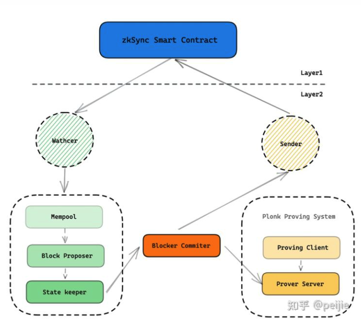

https://zhuanlan.zhihu.com/p/363029544

合约在链上
要想使用zksync 必须先往合约里面转钱

watcher 会监视链上的交易并且同步 同时链下的交易也会同步

L1 的核心为智能合约，主要负责存款、提款、交易验证；

L2 分为 L1 交互（Watcher、Sender）、L2 状态维护（Mempool、Block Proposer、State Keeper、Block Commiter）、零知识证明系统。

生成一个wlllet 生成一个singer
zkSync Signer 专用于 L2 交易签名，但收款地址依然采用以太坊地址，底层签名则是采用 zkSync Signer；
用户除了首次设置公钥之外，其余场景均对 Signer 没有感知。